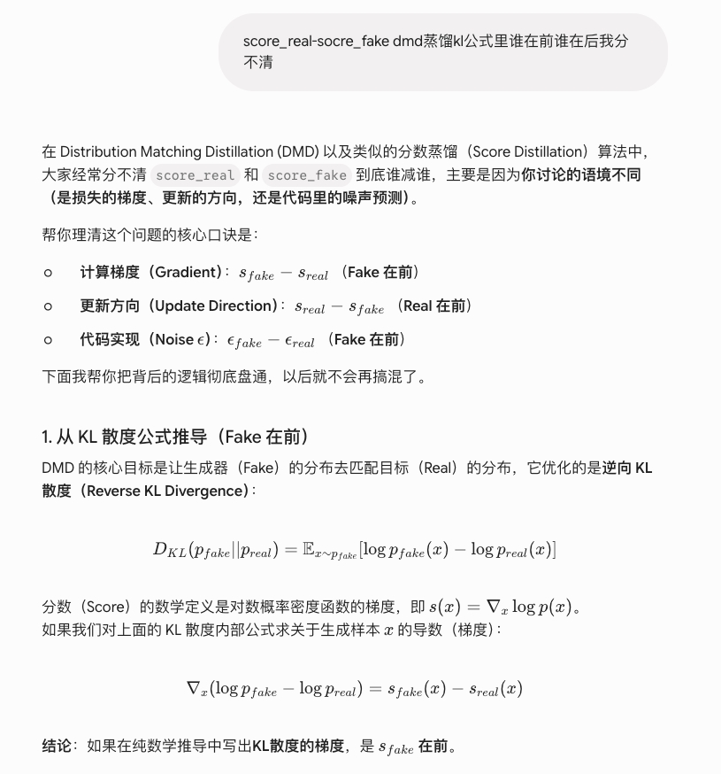

# DMD / DMD2 / Consistency Model：分布蒸馏与轨迹蒸馏如何协作

> 记录日期：2026-07-08 / 更新：2026-07-09（+DMD score_real/score_fake 符号辨析：KL 梯度、更新方向、epsilon 代码方向） | 触发人：李承燕
> 触发问题：「dmd为什么要用（sreal梯度-sfake梯度），sreal梯度会变化吗，为什么用sfake不直接用s学生，回归损失的作用又是什么，dmd2中为什么又换成gan loss，gan loss如何实现？cm和dmd如何协作，它们一个是轨迹蒸馏，一个是分布蒸馏，哪个更好优劣如何」
> 追加问题：「score_real-score_fake / score_fake-score_real 在 DMD 蒸馏 KL 公式里谁在前谁在后分不清」

---

## 一句话总结

DMD 的核心不是让学生逐点复刻 teacher 采样轨迹，而是让学生输出分布往 teacher/real 分布靠：reverse KL 的样本梯度是 `s_fake - s_real`，梯度下降后的 generator update 方向等价于 `s_real - s_fake`；`s_real` 通常是冻结 teacher/real score，参数不变但输入变所以数值会变；`s_fake` 必须是单独训练的 fake score critic，因为学生生成器本身不是 fake 分布的 score estimator。原版 DMD 的 regression loss 是稳定锚点，DMD2 用更强 fake critic 更新 + GAN loss 取代它，让学生直接利用真实数据并突破 teacher 采样路径上限。CM/LCM 更像“轨迹/一致性蒸馏”，DMD/DMD2 更像“分布蒸馏”，工程上最好串起来：先轨迹蒸馏保结构，再分布蒸馏提质感。

---

## 1. 先把三个对象分清楚

### 1.1 学生生成器 Gθ

通常是一个 one-step / few-step generator：

```text
z, c, maybe t  ->  Gθ  ->  image / latent
```

它的职责是从噪声直接出图或少步出图。它不是一个完整的 score model，不天然给出 `∇x log p_fake(x_t)`。

### 1.2 real score / teacher score：s_real

DMD 里 `s_real` 是目标分布的 score，工程上用预训练 diffusion teacher 近似。

```text
s_real(x_t, t, c) ≈ ∇_{x_t} log p_real,t(x_t | c)
```

文生图场景下它通常还要包含 CFG 目标，即 guided teacher score：

```text
s_guided = s_uncond + w * (s_cond - s_uncond)
```

如果 DMD 阶段的 teacher guidance scale 和前置 CM/LCM 阶段内化的 guidance 假设不一致，容易出现目标分布错位、饱和度漂移、prompt alignment 下降。

### 1.3 fake score critic：s_fake

`s_fake` 是学生当前生成分布的 score：

```text
s_fake(x_t, t, c) ≈ ∇_{x_t} log p_fake,t(x_t | c)
```

它要单独训练，输入是学生生成图/latent 加噪后的 `F(Gθ(z), t)`，用 denoising score matching 学当前 fake 分布。DMD2 进一步指出：如果 fake critic 跟不上非平稳的学生分布，generator 梯度会偏，训练会抖甚至 collapse。

---

## 2. 为什么是 `s_real - s_fake`

DMD 优化的是学生 fake 分布到目标 real/teacher 分布的 KL：

```text
KL(p_fake,t || p_real,t)
```

对 generator 参数求导时，论文给出的形式可以写成：

```text
∇θ L_DMD
= E_t [ ∇θ KL(p_fake,t || p_real,t) ]
= - E_t ∫ (s_real(F(Gθ(z), t), t) - s_fake(F(Gθ(z), t), t)) · dGθ(z)/dθ dz
```

所以从 generator update 角度看，推动样本移动的方向就是：

```text
s_real - s_fake
```

直觉：

- `s_real`：告诉你“往哪里更像真实/teacher 分布”
- `s_fake`：告诉你“哪里只是当前学生自己已经堆出来的高密度区域”
- 两者相减：不是盲目往最近 real mode 冲，而是在降低 fake 和 real 两个分布的差异

如果只用 `s_real`，会变成 SDS / VSD 里常见的“往高概率区域吸”，容易 mode-seeking / collapse。DMD 原文 toy example 也展示了：只最大化 real score 会把 fake 样本推到最近 mode；加上 fake score difference 才有分布匹配味道。

注意符号问题：论文里对 KL 的梯度有一个负号；实际代码里你可以理解为 loss 梯度下降后，样本更新方向等价于沿 `s_real - s_fake` 推。

---

## 2.5 `score_real - score_fake` 到底谁在前：三层语境别混

> 原始截图：用户追问 DMD 蒸馏 KL 公式中 `score_real` / `score_fake` 谁在前，截图保存在 `assets/15_dmd_score_sign_screenshot.jpg`。
>
> 

这次截图里的核心困惑是：DMD / Score Distillation 里有时写 `s_fake - s_real`，有时又说更新方向是 `s_real - s_fake`，代码里还会出现 `eps_fake - eps_real`。这三个说法不是互相矛盾，而是在讲三层不同对象。

### 2.5.1 先记一句话

```text
Score 空间：
- KL 对样本 x 的梯度 / 上升方向：s_fake - s_real
- 梯度下降更新样本 / generator 输出的方向：s_real - s_fake

Epsilon-pred 代码空间（VP/DDPM，同一 t、同一 sigma 下）：
- score update direction s_real - s_fake
  对应 epsilon_fake - epsilon_real，再乘 1 / sigma_t
```

所以最短口诀是：

```text
算梯度：fake - real
做更新：real - fake
看 epsilon 代码：eps_fake - eps_real
```

但这个口诀必须带前提：`score` 指标准 log-density score `s(x_t,t)=∇_{x_t} log p_t(x_t)`；目标是最小化 reverse KL `KL(p_fake || p_real)`；epsilon 关系只对常见 VP/DDPM eps-pred 参数化成立。

### 2.5.2 为什么 KL 梯度是 `s_fake - s_real`

DMD 的分布匹配目标是：

```text
KL(p_fake || p_real)
= E_{x~p_fake} [ log p_fake(x) - log p_real(x) ]
```

对 log-ratio 的样本位置 `x` 求导：

```text
∇_x (log p_fake(x) - log p_real(x))
= s_fake(x) - s_real(x)
```

这就是“loss 对样本位置的梯度”或“KL 上升方向”。如果你沿这个方向走，KL 变大；训练要最小化 KL，所以实际更新要走负梯度。

更严谨地说，generator 用 reparameterization `x = Gθ(z)` 后：

```text
∇_θ KL ≈ E_z [ (s_fake(x) - s_real(x)) · ∂x/∂θ ]
```

这里省略的 `E[∇_θ log p_fake]` score-function 项在期望下为 0，DMD 才能把 generator 梯度写成 score difference 的 pathwise 形式。这个点如果不说清，容易误以为“逐点对 x 求导”就是完整 KL 推导。

### 2.5.3 为什么更新方向又变成 `s_real - s_fake`

优化器做的是梯度下降：

```text
x <- x - η · ∇_x KL
  = x - η · (s_fake - s_real)
  = x + η · (s_real - s_fake)
```

所以从“样本被推往哪里”或“generator 输出被如何修正”的角度看，方向是：

```text
s_real - s_fake
```

这也解释了为什么第 2 节写 `s_real - s_fake`：那里讲的是 generator update 方向，不是 KL 的数学梯度本身。

直觉上：

- `s_real` 把样本往目标/teacher/real 高密度方向拉；
- `s_fake` 扣掉当前 fake 分布自己已经堆出来的高密度方向；
- `s_real - s_fake` 才是“缩小两个分布差”的推力。

### 2.5.4 为什么代码里经常是 `eps_fake - eps_real`

如果模型输出的是 noise prediction `epsilon`，常见 VP/DDPM 参数化下：

```text
x_t = alpha_t x_0 + sigma_t epsilon
s(x_t,t) = ∇ log p_t(x_t) = - epsilon_theta(x_t,t) / sigma_t
```

因此：

```text
s_real - s_fake
= (-eps_real / sigma_t) - (-eps_fake / sigma_t)
= (eps_fake - eps_real) / sigma_t
```

所以在 epsilon prediction 代码里，**更新方向**经常表现为：

```text
eps_fake - eps_real
```

注意两个坑：

1. `1/sigma_t` 不改变方向，但会影响不同 timestep 的梯度强度；很多实现会把它吸收到 timestep weighting / SNR weighting 里。
2. 如果代码不是手动 `x += update_direction`，而是构造 dummy loss 让 PyTorch `backward()`，要分清传进去的是“数学梯度”还是“更新方向”。优化器默认会减梯度：如果把 `eps_fake - eps_real` 当作 gradient tensor 直接塞进 loss，又没有额外负号，可能会反向更新。判断标准是：最终参数更新后，`x` 的等效变化应该沿 `s_real - s_fake`，也就是 eps-pred 下沿 `(eps_fake - eps_real)/sigma_t`。

### 2.5.5 参数化 caveat：v-pred / flow matching 不能直接套 eps 口诀

上面的 epsilon 反号只对 VP/DDPM 的 eps-pred 约定成立。若模型用 v-pred、x0-pred、rectified flow / flow matching velocity，score 与网络输出的转换式不同，不能机械写 `eps_fake - eps_real`。

工程排查顺序：

```text
1. 先确认论文里的 score 定义：s = ∇ log p 还是 denoiser/noise residual
2. 再确认代码输出参数化：eps / v / x0 / velocity
3. 把网络输出转换回 score 或 update direction
4. 最后检查 optimizer 是接收梯度，还是手动接收更新方向
```

---

## 3. `s_real` 会变化吗？

分两层：

### 参数层面

原版 DMD / DMD2 里，`μ_real` 通常是冻结的 teacher diffusion model，所以参数不变。

```text
teacher params: frozen
```

### 数值层面

`s_real(x_t,t)` 的输入 `x_t = F(Gθ(z), t)` 会随着学生 Gθ 变化，所以每个 step 算出来的 `s_real` 数值会变。

```text
Gθ 变 -> 生成图变 -> 加噪后的 x_t 变 -> teacher score 数值变
```

所以答案是：

```text
s_real 参数不变；s_real evaluated value 会随学生输出变化。
```

这点和 `s_fake` 不一样：`s_fake` 不仅输入变，它自己的参数也要动态训练，因为 fake 分布本身在移动。

---

## 4. 为什么不用 `s_student`，而要单独学 `s_fake`

核心原因：学生 `Gθ` 不是 `p_fake` 的 score 函数。

### 4.1 score 是分布密度梯度，不是生成器输出

`score` 定义是：

```text
s(x_t,t) = ∇_{x_t} log p_t(x_t)
```

它回答的是：在当前 noisy sample 位置，往哪个方向走，密度会上升。

而 one-step/few-step student `Gθ(z)` 回答的是：给定一个 noise seed，输出一个图。

```text
Gθ: z -> x
score: x_t -> direction in x-space
```

这两个东西不是同一个函数。

### 4.2 直接用学生自己的 denoising prediction 会自举偏

如果学生本身是从 teacher UNet 初始化的 few-step denoiser，你也不能直接把它当 `s_fake`。因为 DMD 需要的是“学生当前输出分布”的 density score，而不是“学生网络对某个 noisy input 的去噪预测”。

`s_fake` 必须在学生生成样本上重新做 denoising score matching，才能追踪 `p_fake`。

### 4.3 critic 和 generator 角色必须分开

DMD 很像 GAN：

```text
generator: 产 fake
critic: 估 real/fake 分布差异
```

只不过 DMD 的 critic 是 diffusion score critic，不是二分类 discriminator。若 generator 自己同时当 critic，梯度会高度自指，早期尤其容易把错误分布强化成“自洽但不真实”的方向。

工程结论：`s_fake` 最好从 teacher / pretrained denoiser 初始化，不能随机初始化。随机 fake critic 早期给出的 score difference 基本是毒梯度。

---

## 5. 原版 DMD regression loss 的作用

原版 DMD 除了 distribution matching gradient，还用了一个 teacher trajectory regression：

```text
L_reg = E_(z,y) d(Gθ(z), y)
```

其中 `(z, y)` 是 teacher 用 deterministic sampler 从同一个 noise `z` 多步采样出来的 pair，`d` 通常用 LPIPS 这类 perceptual distance。

它的作用有四个：

### 5.1 稳定训练

score difference 的质量依赖两个近似：

- `s_real` 是否准确
- `s_fake` 是否跟得上当前 fake 分布

早期 fake critic 很不准，regression loss 就像 anchor，避免 generator 被错梯度带飞。

### 5.2 保大结构 / 语义 / prompt alignment

回归到 teacher deterministic 输出，会强行保住噪声 seed 到图像的大结构映射。对文生图来说，这有利于复杂 prompt 的主体、位置、构图稳定。

### 5.3 保 mode coverage

DMD 原文 toy example 里，不加 regression 的 distribution matching 仍可能漏 mode；加 regression 后覆盖更完整。

### 5.4 代价：昂贵且限制上限

DMD2 指出这个 loss 有两个大问题：

- 成本高：大规模 T2I 要预生成海量 noise-image pairs。DMD2 原文举例，给 SDXL / LAION 规模构造 pair 的成本可达约 700 A100 days，超过他们训练 compute 的 4 倍。
- 限制上限：regression 本质是在学 teacher 的具体采样路径，和 DMD “只匹配分布、不绑定轨迹”的哲学相冲突，也让学生质量受 teacher sampler 输出上限约束。

---

## 6. DMD2 为什么换成 GAN loss

DMD2 不是简单“把 DMD 换成 GAN”，而是三板斧：

1. 去掉 regression loss，回到真正 unpaired distribution matching
2. 用 TTUR 稳定 fake critic，让 `s_fake` 跟上 generator
3. 加 GAN loss，让学生直接利用真实数据，修正 teacher real score 的近似误差

### 6.1 去 regression 后为什么会不稳定

DMD2 原文分析：去掉 regression 后训练不稳，主要因为 fake diffusion critic `μ_fake` 没有准确追踪 generator 当前输出分布。

学生分布是非平稳的：

```text
Gθ 每 update 一次 -> p_fake 变一次 -> s_fake 目标也变
```

如果 fake critic 更新频率太低，`s_fake` 估偏，`s_real - s_fake` 方向就错。

DMD2 用 two time-scale update rule：critic 更新更频繁。论文正文提到 ImageNet 设置里使用过 `5 fake score updates / 1 generator update` 能稳定，但这不是通用死配方；SDXL / 大模型场景要按 batch、显存、critic loss 滞后程度调。

### 6.2 为什么 GAN loss 能补 teacher real score 的误差

DMD 的 `s_real` 来自 teacher diffusion model，不是真实 oracle。teacher score 有近似误差，且原版 DMD 学生从不直接看 real data，只看 teacher score / teacher pair。

DMD2 加 GAN discriminator：

```text
real image vs generated image
```

这样学生能从真实数据分布得到额外监督，可能突破 teacher deterministic sampler 的上限。

论文结果也支持这一点：

- ImageNet-64：DMD 1-step FID 2.62；DMD2 longer training 1-step FID 1.28
- zero-shot COCO 2014：DMD2 8.35 FID；推理成本约 500× reduction
- SDXL 蒸馏场景：DMD2 1-step / 4-step 在 COCO 10K 上 FID 和 patch FID 都强于多种 few-step baseline

---

## 7. DMD2 的 GAN loss 如何实现

DMD2 的设计很 minimal：不是单独塞一个大 discriminator，而是在 fake diffusion denoiser 的 bottleneck / mid-block 特征上加一个轻量 classification head。

输入也不是 clean image，而是同一个 forward diffusion process 加噪后的样本：

```text
real branch: F(x_real, t)
fake branch: F(Gθ(z), t)
```

DMD2 原文写的 standard non-saturating GAN objective：

```text
L_GAN = E_{x~p_real, t~[0,T]} [ log D(F(x,t)) ]
      + E_{z~p_noise,t~[0,T]} [ - log D(F(Gθ(z),t)) ]
```

其中：

- `D` 是 classification branch
- `F` 是 forward diffusion / noise injection
- discriminator / classifier 最大化这个目标
- generator 最小化这个目标里的 fake 项，使 fake 被判成 real

工程伪代码：

```python
# real image / latent
x_real = sample_real_batch()

# fake image / latent
z = torch.randn_like_noise()
x_fake = G_theta(z, cond)

# sample diffusion timestep and noise both real/fake to same style domain
t = sample_t()
x_real_t = forward_diffuse(x_real, t)
x_fake_t = forward_diffuse(x_fake.detach(), t)   # train D / fake critic

# discriminator head shares fake denoiser backbone features
logit_real = D_head(fake_denoiser_backbone(x_real_t, t, cond).mid)
logit_fake = D_head(fake_denoiser_backbone(x_fake_t, t, cond).mid)

# D objective: maximize log D(real) + log(1-D(fake))
loss_D = softplus(-logit_real).mean() + softplus(logit_fake).mean()
loss_D.backward()

# G objective: make fake look real under D
x_fake = G_theta(z, cond)
x_fake_t = forward_diffuse(x_fake, t)
logit_fake_for_G = D_head(fake_denoiser_backbone(x_fake_t, t, cond).mid)
loss_G_gan = softplus(-logit_fake_for_G).mean()

# total generator loss
loss_G = loss_dmd + lambda_gan * loss_G_gan
loss_G.backward()
```

实现坑：fake denoiser backbone 同时承担 score matching 和 GAN classification，两路梯度可能打架。落地时要控制 GAN loss 权重、学习率、更新频率；必要时对部分共享特征 stop-gradient 或做分支隔离，避免 GAN 梯度把 score feature 洗坏。

---

## 8. CM / LCM 和 DMD / DMD2 如何协作

### 8.1 CM 是轨迹/一致性蒸馏

Consistency Model / Latent Consistency Model 的核心是：同一条 PF-ODE / diffusion trajectory 上，不同时间点映射到同一个 clean point 要一致。

它更像学：

```text
沿 teacher trajectory，x_t -> x_0 的映射要一致
```

优点：

- 训练信号直接，稳定
- 结构、语义、prompt alignment 通常好
- 和 teacher 轨迹绑定强，适合做 warm start / acceleration base

缺点：

- 容易继承 teacher sampler 的路径缺陷
- few-step 质量上限受轨迹约束
- 质感/FID 可能不如强分布匹配或 adversarial finetune

### 8.2 DMD 是分布蒸馏

DMD 不要求学生和 teacher 的 noise-to-image path 一一对应，只要求最终输出分布接近 teacher/real distribution。

它更像学：

```text
不管你怎么走，最后生成分布像 teacher / real 就行
```

优点：

- 不绑死 teacher trajectory
- 有机会超越 teacher deterministic sampler
- 对 one-step / few-step 高质感更有利

缺点：

- 训练更像 GAN：critic 跟不上就炸
- prompt 细节、复杂主体关系可能不如轨迹蒸馏稳
- fake score / GAN critic 工程复杂，超参敏感

### 8.3 推荐组合：先轨迹，后分布

最稳工程路线：

```text
Teacher diffusion
  -> CM / LCM / trajectory distillation warm start
  -> DMD / DMD2 distribution finetune
  -> optional small supervised / preference / reward alignment
```

原因：

- CM 阶段先把大结构、语义、prompt following、时间步参数化对齐
- DMD2 阶段再用 distribution matching + GAN real-data signal 补细节、质感、FID
- 避免 DMD 从零起步时 fake critic 冷启动和 generator 崩盘

但接缝要小心：

1. 参数化接缝：CM/LCM 常有 `c_skip(t), c_out(t)` 边界条件和时间缩放；DMD one-step generator 可能直接固定成 `z -> x`。如果直接接，scaling factor 错位会炸。
2. guidance 接缝：CM 阶段可能已经 bake-in CFG；DMD 阶段的 `s_real` 也要用同一 guidance scale 或重新校准。
3. 多步接缝：DMD2 支持 multi-step 时，还要处理 training-inference input mismatch。训练时要模拟推理时 generator samples，而不是只训练 teacher trajectory 上的中间状态。

---

## 9. 哪个更好：不是二选一

### 9.1 如果目标是“稳、prompt 对齐、大结构”

优先 CM / LCM / trajectory distillation。

适合：

- 需要快速得到可用 few-step base
- prompt alignment 比极致 FID 更重要
- 多主体、空间关系、编辑结构稳定性优先

### 9.2 如果目标是“极限质感、FID、one-step/few-step 上限”

优先 DMD2 / distribution matching + GAN。

适合：

- 已有较好 warm start
- 愿意调 critic / GAN 超参
- 目标是商业推理降步数，同时尽量保持甚至超过 teacher 视觉质量

### 9.3 生产建议

最佳实践不是“CM vs DMD”，而是：

```text
CM 负责先把路铺直；DMD2 负责最后把分布推漂亮。
```

如果只能选一个：

- 低风险上线：选 CM/LCM
- 追一阶/四阶 SOTA：选 DMD2，但要接受 GAN/DMD 训练不稳定成本
- 做图像编辑：更偏 CM/trajectory + supervised/edit reconstruction，因为编辑任务对输入结构保持比 FID 更敏感；DMD2 可作为后段小权重质感 finetune，不宜一上来重训

---

## 10. 搜索与来源自检

本条目按 knowledge-record workflow 做了多源检索：

- 已有知识库：命中 10_SFT与RL的KL散度视角及On-Policy蒸馏.md；交叉引用 12_OPD_ReverseKL_策略梯度必要性.md；2026-07-09 追加时直接增量更新本条目第 2.5 节
- zh-cache：已查，本地缓存未命中 DMD/DMD2 专项中文内容
- arXiv：命中 DMD、DMD2、Consistency Models；2026-07-09 追加时复查 DMD、DMD2、VSD、DreamFusion 摘要
- HuggingFace API：搜索 DMD / consistency distillation，返回空模型列表；2026-07-09 搜索 `Distribution Matching Distillation DMD score distillation` 仍返回空模型列表
- GitHub API：命中 Zeqiang-Lai/OpenDMD、devrimcavusoglu/dmd、多个 consistency model repo；2026-07-09 精确搜索 DMD/DMD2 组合未额外命中新 repo
- Google via r.jina.ai：返回 Google redirect，未拿到有效结果
- 知乎：返回 CAPTCHA 安全验证页，未拿到有效结果
- 小红书：只返回页脚备案信息，未拿到有效结果

---

## 11. 多模型交叉审核合并

### Gemini 3.1 Pro 补充

1. 文生图 DMD 的 `s_real` 必须考虑 CFG baked-in guided score，否则学生会缺 prompt following 和高质量 guidance 分布。
2. `s_fake` 不宜随机初始化，最好从 teacher / pretrained UNet/DiT 初始化；否则早期 score difference 是毒梯度。
3. GAN head 和 fake score backbone 共享特征时，GAN 梯度可能破坏 score feature，需要控制权重、学习率或做梯度隔离。
4. CM warm start 到 DMD finetune 存在参数化割裂：CM 的时间边界条件和 DMD 的 one-step generator 参数化要接好。
5. 去掉 regression 后，复杂 prompt / 多主体结构可能比原版 trajectory / regression 锚定更弱，要在实践建议里标注 trade-off。

### Claude Opus 4.8 补充

1. DMD 的 `(s_real - s_fake)` 应解释为 pathwise derivative，因为图像 latent 是连续变量，可以通过 `x = Gθ(z)` 对 θ 求导；这和离散 token OPD 的 REINFORCE score-function 梯度不同，但二者都在处理“采样分布随参数变化”的问题。
2. TTUR 方向是 fake critic 更新更频繁，但比例不是通用硬规则；`5:1` 可标为 ImageNet 经验。
3. DMD2 的 discriminator 不是独立大 D，而是复用 fake score 网络中间特征，在 noised real/fake 上判别。
4. DMD2 还有第三板斧：multi-step sampling 的 backward simulation，解决 training-inference input mismatch。
5. CM/LCM 与 DMD 串联时要统一 guidance scale 假设，否则 DMD 阶段目标分布会偏。

### GLM-5.2

本次 CLI 审核 180 秒超时，未纳入合并；不编造其意见。

### 2026-07-09 追加：DMD 符号辨析审核

- Gemini 3.1 Pro 补充：epsilon 空间必须区分“数学梯度”和“更新方向”；`s_real - s_fake` 对应 `(eps_fake - eps_real)/sigma_t` 是更新方向，不是 eps 空间的 KL 梯度本身。若用 dummy loss + optimizer backward，要保证传入的是梯度而非更新方向，或显式加负号。
- Claude Opus 4.8 补充：`∇_x(log p_fake - log p_real)=s_fake-s_real` 只是 log-ratio 的逐点梯度；完整 generator 梯度经 reparameterization 后写成 `E[(s_fake-s_real)·∂x/∂θ]`，其中 score-function 项期望为 0。epsilon 公式需限定 VP/DDPM eps-pred、同一 timestep/sigma；v-pred / flow matching 不能直接套口诀。
- GLM-5.2：本次 CLI 审核 180 秒超时，未纳入合并。

---

## 12. 参考资料

- Yin et al., One-step Diffusion with Distribution Matching Distillation, CVPR 2024: https://arxiv.org/abs/2311.18828
- DMD project page: https://tianweiy.github.io/dmd/
- Yin et al., Improved Distribution Matching Distillation for Fast Image Synthesis, NeurIPS 2024 Oral: https://arxiv.org/abs/2405.14867
- DMD2 project page: https://tianweiy.github.io/dmd2/
- Song et al., Consistency Models, ICML 2023: https://arxiv.org/abs/2303.01469
- Luo et al., Latent Consistency Models / LCM-LoRA: https://arxiv.org/abs/2310.04378
- OpenDMD implementation: https://github.com/Zeqiang-Lai/OpenDMD
- DMD PyTorch implementation: https://github.com/devrimcavusoglu/dmd
- 本地知识库交叉引用：12_OPD_ReverseKL_策略梯度必要性.md
