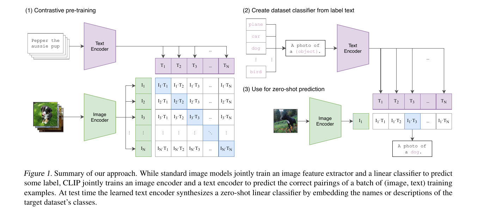
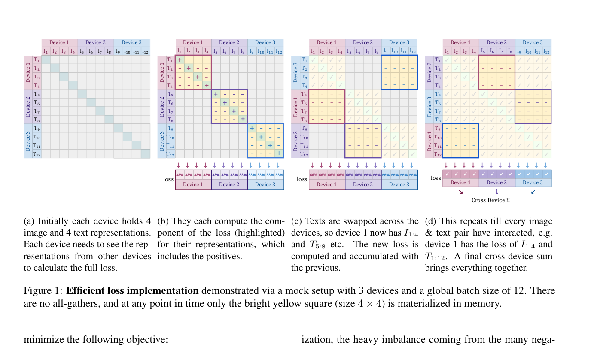
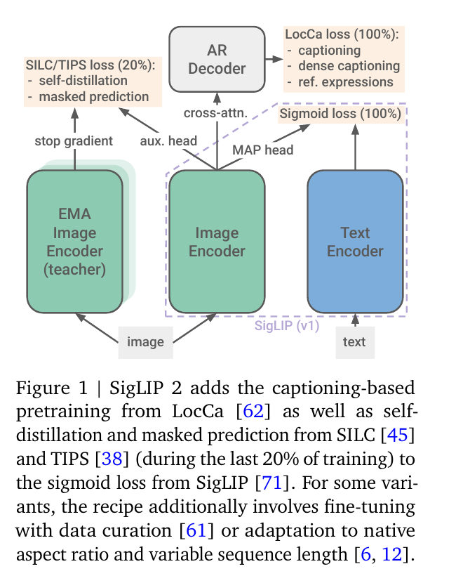
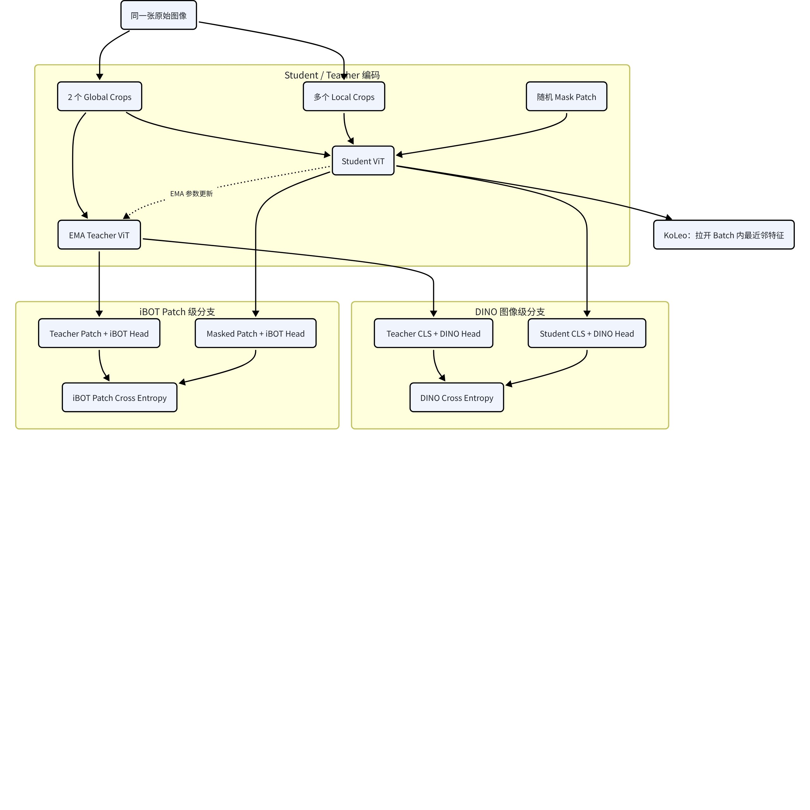
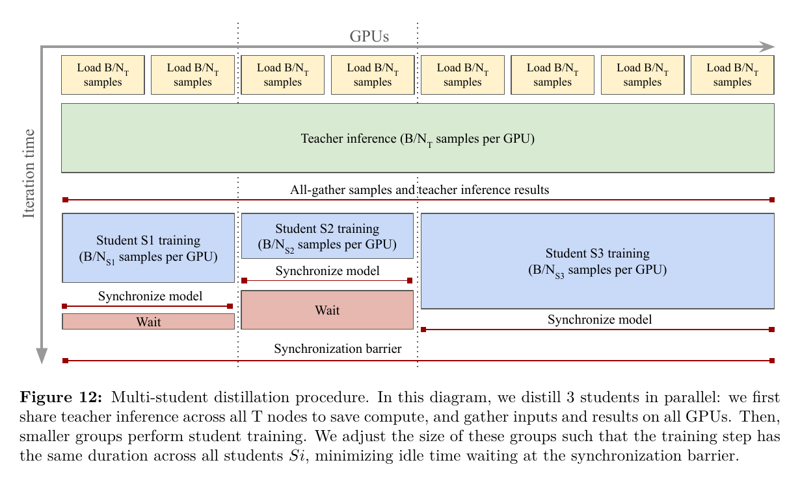

# 视觉表征模型全解析：CLIP / SigLIP / SigLIP 2 / DINOv2 / DINOv3

> 记录日期：2026-08-03 / 更新：2026-08-03（补充 CLIP、SigLIP、SigLIP 2、DINOv3 论文原图与 DINOv2 训练架构图）
> 触发人：李承燕
> 触发问题：「siglip，siglip2，clip，dinov2，dinov3 结构、训练 loss、用途详情等等对比分析」

## 一句话总结

这五个模型其实分两条路线：**CLIP / SigLIP / SigLIP 2 用图文配对监督学习“图像和语言是否匹配”**，强项是零样本分类、检索、VLM 视觉塔和图文 reward；**DINOv2 / DINOv3 只看图像，通过 student–EMA teacher 自蒸馏学习“同一物体/区域在不同视图下应保持一致”**，强项是 patch-level 稠密特征、分割、深度、对应关系和结构保持。工程上通常不是五选一，而是 **SigLIP 2 管语义，DINOv3 管空间与局部结构**。

## 1. 先看代码级结构

| 模型 | 输入 | 主干结构 | 输出 | 文本塔 | 训练时额外模块 | 发布后是否保留 |
|---|---|---|---|---|---|---|
| CLIP | 图像 + 文本 | 图像端 Modified ResNet 或 ViT；文本端 causal Transformer | 一对 L2-normalized 全局 embedding | 有 | 两个线性投影 + learnable temperature | 两个 encoder 都保留 |
| SigLIP | 图像 + 文本 | 图像 ViT + 文本 Transformer，通常用 MAP attention pooling | 全局 image/text embedding | 有 | learnable scale + bias | 两个 encoder 都保留 |
| SigLIP 2 | 图像 + 文本 | 与 SigLIP 基本同构；固定分辨率 ViT 或 NaFlex ViT；MAP pooling | 全局 embedding + 更强 unpooled patch features | 有，Gemma multilingual tokenizer | LocCa Transformer decoder、EMA teacher、自蒸馏 head、masked-prediction head | 只保留双 encoder；decoder/teacher/head 丢弃 |
| DINOv2 | 仅图像 | ViT-S/B/L/g，patch size 14；student 与 EMA teacher 同构 | CLS 全局特征 + patch 稠密特征 | 无 | DINO head、iBOT head、mask token、EMA teacher | 只保留 teacher backbone；projection heads 通常不用 |
| DINOv3 | 仅图像 | 主模型 ViT-7B/16，axial RoPE、SwiGLU、4 个 register tokens（仓库配置键名为 `n_storage_tokens`）；另蒸馏 ViT/ConvNeXt | CLS + 高质量 patch dense features | 基础 backbone 无；可后训练对齐文本 | DINO/iBOT/KoLeo heads、EMA teacher、Gram teacher、蒸馏模块 | 发布 backbone；具体 text adapter/head 另算 |

最直白地说：

- CLIP / SigLIP：`image_encoder(image) -> [B,D]`，`text_encoder(text) -> [B,D]`，训练两个向量空间对齐。
- DINO：`student(crop/masked_image)` 去拟合 `stop_grad(EMA_teacher(other_crop/full_image))`，没有文本。
- SigLIP 2：把前两类拼到一起，但最终仍发布一个轻量的 CLIP-style 双塔，而不是把训练辅助 decoder 带到推理阶段。

## 2. CLIP：batch 内多分类式图文对比学习

### 2.1 结构



上图来自 CLIP 原论文 Figure 1，串起了 image-text contrastive pretraining、用 label text 构造 classifier，以及 zero-shot prediction 三个阶段。

OpenAI CLIP 是标准双塔：

1. 图像塔：Modified ResNet 或 ViT。
2. 文本塔：causal Transformer，取 EOT token 作为句向量。
3. 两端分别过线性 projection 到共同维度。
4. L2 normalize 后做矩阵乘法，得到 `B × B` 图文相似度矩阵。
5. 用可学习 `logit_scale = exp(s)` 控制温度，官方实现初始化约等于 `1 / 0.07`。

代码骨架：

```python
image_feat = normalize(image_encoder(images))   # [B, D]
text_feat  = normalize(text_encoder(texts))      # [B, D]
logits_i2t = exp(logit_scale) * image_feat @ text_feat.T
logits_t2i = logits_i2t.T
```

### 2.2 Loss

CLIP 的核心是双向 InfoNCE / symmetric softmax cross-entropy：

```python
labels = torch.arange(B)
loss_i = F.cross_entropy(logits_i2t, labels)
loss_t = F.cross_entropy(logits_t2i, labels)
loss = (loss_i + loss_t) / 2
```

每张图在一整行文本中做一次 `B-way classification`，每段文本在一整列图像中再做一次。正样本是对角线，batch 里其他 pair 都作为负样本。

关键后果：

- loss 依赖整张相似度矩阵的 softmax normalization。
- batch 越大，负样本越多，通常越利于对比学习，但全局 all-gather 和显存/通信压力也越大。
- 如果一张图对应多个同义 caption，标准 one-positive label 会把其他真实匹配误当负样本，存在 false negative。
- 输出全局语义很强，但原始 CLIP 目标并不直接约束 patch 级定位，因此 dense prediction 通常不是强项。

## 3. SigLIP：把 batch 多分类改成独立二分类

### 3.1 结构

SigLIP 仍然是图像塔 + 文本塔的双 encoder，主要创新不在 backbone，而在 loss。Google big_vision 与 Transformers 实现都先计算归一化 image/text embedding，再形成 pairwise logits：

```python
logits = image_feat @ text_feat.T
logits = scale * logits + bias
```

其中 scale 与 bias 可学习。结构上常见 ViT + Transformer + MAP attention pooling。

### 3.2 Loss



上图来自 SigLIP 原论文 Figure 1，重点不是 backbone，而是展示 sigmoid pair loss 如何避免 global all-gather 和完整 `B×B` 矩阵常驻显存。

SigLIP 不对每一行做 softmax，而是把 `B²` 个 image-text pair 分别看成 binary classification：

```python
y = 2 * torch.eye(B) - 1   # diagonal +1, off-diagonal -1
loss = -F.logsigmoid(y * logits).sum() / B
```

等价于对正 pair 做 `softplus(-logit)`，对负 pair 做 `softplus(logit)`。

与 CLIP 的本质差别：

| 维度 | CLIP | SigLIP |
|---|---|---|
| 单个 image 的任务 | 从 B 个文本中选一个 | 对每个 image-text pair 独立判断匹配/不匹配 |
| normalization | 行/列 softmax | sigmoid，无全局 softmax |
| loss 耦合 | 一行样本彼此竞争 | pair 间更解耦 |
| 分布式需求 | 通常依赖 global negatives / all-gather | 不要求为了 normalization 获取全局相似度视图 |
| batch size | 大 batch 很重要 | 小 batch 也能保持竞争力；论文观察 32k 已基本够用 |
| 多正样本扩展 | 需要改 labels/loss | 直接把多个 pair 标为正更自然 |

SigLIP 论文报告：仅 4 个 TPUv4、两天训练的 SigLiT 达到 84.5% ImageNet zero-shot；其极端 batch 实验做到 1M，但收益很快饱和，32k 更合理。

### 3.3 用途

SigLIP 适合：

- 图文检索、零样本分类、图文匹配 reward。
- VLM 的视觉 encoder，例如把 pooled 或 patch tokens 接 projector 后喂给 LLM。
- 大规模分布式图文预训练，尤其不想让 loss 强依赖 global softmax 时。
- 多标签或一图多文本场景，pairwise binary target 更容易扩展。

它仍主要是 global image-text alignment；如果直接拿 vanilla SigLIP patch token 做分割/深度，不应预期达到 DINOv2/3 的 dense 特征质量。

## 4. SigLIP 2：SigLIP 主线 + caption/localization + DINO-style dense supervision

### 4.1 结构没有推翻 SigLIP



这张原论文总览图最关键：底部是 SigLIP v1 双塔；右上接 LocCa AR decoder；左上在最后 20% 训练加入 EMA teacher、自蒸馏和 masked prediction。

SigLIP 2 明确保持与 SigLIP 的架构兼容：固定分辨率版仍是 standard ViT + learned positional embedding；图像塔和文本塔大体同构，视觉和文本表示都用 MAP attention pooling。g-sized vision encoder 配 So400m text encoder。

重要变化：

- multilingual Gemma tokenizer，词表 256k，text length 64。
- WebLI：10B images / 12B alt-texts / 109 languages；训练 mixture 为 90% English + 10% non-English。
- 四档规模：ViT-B 86M、L 303M、So400m 400M、g 1B。
- NaFlex 版本保留原生 aspect ratio，并允许 variable sequence length / resolution。

### 4.2 Stage 1：Sigmoid loss + LocCa decoder loss

第一阶段把 SigLIP loss 与 LocCa decoder loss **等权相加**：

```text
L_stage1 = L_sigmoid + L_LocCa
```

LocCa 是接在未 pooling 的 vision tokens 上的 Transformer decoder：

- 结构尺寸接近 text encoder。
- 增加 cross-attention。
- decoder 层数约为 text encoder 的一半。
- 同一训练样本做三类 decoder forward：image captioning、automatic referring expression prediction、grounded captioning。
- referring expression：给 region caption，预测 bounding-box coordinates。
- grounded captioning：给 bounding box，预测区域 caption。
- token 训练本质上是 decoder token cross-entropy；caption 目标有 50% 概率采用 parallel masked-token prediction，而非 causal mask。

这个 decoder 只用于 representation learning，正式 checkpoint 不带 decoder，所以推理没有额外成本。

### 4.3 Stage 2：训练最后 20% 再加两项 image-only loss

在训练完成 80% 时，SigLIP 2 才初始化 EMA teacher、额外 MLP heads 和 mask token，并加入：

1. **local-to-global self-distillation**：student 看 8 个 local views，EMA teacher 看 1 个 full/global view；student pooled feature 在独立高维 MLP head 空间拟合 teacher feature。
2. **masked prediction**：student 的 50% image patch embedding 被替换成 mask token，teacher 看未 mask 的同一 global view；只在 masked locations 上匹配 patch feature。

论文给出的基础权重：

```text
L_extra = 1.0 * L_local_global + 0.25 * L_masked_patch
L_total = L_sigmoid + L_LocCa + model_scale_factor * L_extra
```

`model_scale_factor` 对 B/L/So400m/g 分别是 `0.25 / 0.5 / 1.0 / 0.5`。

设计意图很清楚：

- Sigmoid loss 保留 global language semantics。
- LocCa 给 OCR、region grounding、localization。
- self-distillation + masked prediction 把局部 patch 语义补起来，改善 segmentation、depth 等 dense task。
- 原图用于 SigLIP/LocCa；额外强 augmentation views 只用于 self-supervised losses，避免破坏图文对齐。

### 4.4 SigLIP 2 相比 SigLIP 到底升级在哪

不是“sigmoid loss 2.0”，而是从单一 global alignment 升成多任务表征学习：

```text
图文全局语义：Sigmoid pair loss
区域语言与定位：caption / region→box / box→caption decoder CE
图像全局不变性：local→global EMA self-distillation
图像局部特征：masked patch prediction
多语言：Gemma tokenizer + multilingual WebLI mixture
任意长宽比：NaFlex
```

官方 checkpoint 数据中，SigLIP 2 g-opt/16 384 达到 85.0 ImageNet zero-shot；So400m/16 384 为 84.1，B/16 224 为 78.2。它是目前这组模型里最适合做“同时需要文本语义和还不错 dense feature”的默认选择。

## 5. DINOv2：纯图像 student–teacher，CLS 和 patch 一起蒸馏

### 5.1 结构



原论文没有一张覆盖全部 loss 的端到端架构图；此图严格按论文与官方实现重绘，Mermaid 源码保存在 `assets/20_visual_encoders/dinov2_arch.mmd`。

DINOv2 没有文本塔，是 image-only self-supervised ViT。训练时存在两个同构 backbone：

- student：梯度更新。
- teacher：student 参数的 EMA，不反传。

每张图生成 global crops 与 local crops；teacher 主要看 global crop，student 看 global + local crop。backbone 输出：

- CLS token：图像级/global 表征。
- patch tokens：局部/dense 表征。

发布模型是 teacher backbone，训练用 DINO/iBOT projection heads 不属于日常 feature extraction 主干。

### 5.2 Loss 组成

DINOv2 可近似写成：

```text
L_DINOv2 = L_DINO_cls + λ_ibot L_iBOT_patch + λ_koleo L_KoLeo
```

#### DINO CLS loss

student 与 teacher 的 CLS token 分别进独立 MLP DINO head，输出 prototype logits。student 做 temperature softmax，teacher 用 temperature sharpening + EMA centering 或 3-step Sinkhorn-Knopp，最后做 cross-entropy：

```text
CE(teacher_prototype_distribution(global_crop),
   student_prototype_distribution(other_global_or_local_crop))
```

它约束“同一图像不同 crop 的全局语义一致”。teacher 参数由 EMA 更新。

#### iBOT patch loss

student 输入随机 mask 一部分 patch，teacher 输入不 mask 的图。两端 patch token 通过 iBOT head，在 student 被 mask 的位置做 prototype-distribution cross-entropy。

它约束“被遮住位置的局部视觉语义可以由上下文预测，并与 teacher 保持一致”，直接提升 patch-level 特征。

#### KoLeo regularizer

对 L2-normalized CLS features，找到 batch 内最近邻距离，最小化：

```text
L_KoLeo = -mean(log(distance_to_nearest_neighbor))
```

它不是分类 loss，而是防止 feature 聚成少数模式，鼓励 embedding 在 hypersphere 上铺开。

其他关键点：DINO 与 iBOT 使用分开的 MLP heads；teacher 分布用 Sinkhorn-Knopp 做 balanced prototype assignment；最后有短时高分辨率训练。

### 5.3 能做什么

DINOv2 的强项不是“根据文字理解图”，而是“把图像本身拆成稳定、可迁移、局部一致的 feature map”：

- semantic segmentation、depth estimation、detection backbone。
- keypoint / correspondence / tracking / 3D matching。
- 图像聚类、去重、异常检测、数据筛选。
- 生成/编辑模型里的 perceptual loss、content preservation、patch correspondence loss。
- 作为冻结视觉 backbone，少量 linear/DPT/Mask2Former head 即可迁移。

局限：原生没有 text encoder，不能像 CLIP/SigLIP 一样直接算 prompt-image similarity 或 open-vocabulary text retrieval。Meta 后续有 dino.txt 文本对齐模块，但这不是原始 DINOv2 backbone 的基础训练目标。

## 6. DINOv3：把 DINOv2 扩到 7B，并用 Gram Anchoring 修 dense feature 退化

### 6.1 Backbone 与规模变化



上图来自 DINOv3 原论文 Figure 12：多个 student 共享一次 7B teacher inference，再按学生计算量划分 GPU group 并行蒸馏，避免重复支付大 teacher 的前向成本。

DINOv3 主训练模型是 ViT-7B/16，官方配置约 6.716B 参数，训练集 LVD-1689M。相对 DINOv2：

- patch size 从主流 `/14` 改为 `/16`。
- axial RoPE 位置编码，不再只靠 learned absolute positional embedding。
- SwiGLU FFN、LayerScale、4 个 register tokens。官方论文统一称 register；代码配置内部使用 `n_storage_tokens` 命名。
- 1M iteration 采用 constant LR / weight decay / EMA momentum 主体 schedule，而非预先绑定终点的多组 cosine schedule。
- 主模型训练后蒸馏到 ViT-S/S+/B/L/H+，也蒸馏到 ConvNeXt Tiny/Small/Base/Large。
- 除 web LVD-1689M 外还有 SAT-493M 卫星版本。

公开预训练家族包含：ViT-S 21M、S+ 29M、B 86M、L 300M、H+ 840M、ViT-7B 6.716B，以及 29M–198M 的 ConvNeXt 系列。

### 6.2 基础 loss 仍然是 DINOv2 家族

DINOv3 主 pretrain 没把 DINO/iBOT 推倒重来。官方配置仍为：

```text
L_base = 1.0 * L_DINO_cls + 1.0 * L_iBOT_patch + 0.1 * L_KoLeo
```

相对 DINOv2 recipe，DINOv3 明确在 DINO 与 iBOT 两个 objective 中都用 SwAV-style Sinkhorn-Knopp 替代普通 centering，并给 global crop 与 local crop backbone outputs 使用独立 LayerNorm；论文报告后者让 late-training ImageNet kNN 稳定性约提升 0.2，并改善 dense evaluation。

ViT-7B 配置中：

- DINO head prototypes：262,144；bottleneck 512；hidden 8192。
- iBOT head prototypes：98,304；bottleneck 384；hidden 4096。
- mask probability 0.5；mask ratio 0.1–0.5。
- global crop 256，local crop 112，8 个 local crops。
- EMA momentum 0.994，teacher temperature 从 0.04 warm 到 0.07。

### 6.3 为什么需要 Gram Anchoring

大模型训练很久后，global benchmark 可能继续提升，但 patch similarity map 会逐渐变脏：局部 patch feature 的内部几何关系退化。单纯 DINO CLS / iBOT masked classification 并不能完全阻止这种 long-horizon dense collapse。

DINOv3 的 Gram loss 不直接要求 student patch feature 等于 teacher patch feature，而是要求两者的 **patch-to-patch cosine similarity matrix** 一致。更严格地说，它对 L2-normalized patch feature 的 `P×P` Gram matrix（此时 dot product 等价于 cosine similarity）做 Frobenius 范数平方；代码实现为逐元素 MSE：

```python
student = F.normalize(student_patch, dim=-1)   # [B,N,D]
teacher = F.normalize(anchor_patch, dim=-1)
G_s = student @ student.transpose(-1, -2)      # [B,N,N]
G_t = teacher @ teacher.transpose(-1, -2)
L_gram = F.mse_loss(G_s, G_t)
```

所以总目标可写为：

```text
L_DINOv3 = L_DINO + L_iBOT + 0.1 L_KoLeo + λ_gram L_Gram
```

官方 Gram-anchor phase：

- 使用 512 resolution、无 distortion 的 Gram-teacher crop。
- Gram loss 只在 global crops 上计算。
- Gram 在 image level 计算，使用全部 tokens。
- Gram weight 从 0 逐步升到 2.0。
- Gram teacher 是从较早、dense property 更好的 EMA teacher checkpoint 取出的独立锚点，不是每一步都跟随在线 EMA；refinement 阶段每 10k iterations 更新成当时的主 EMA teacher。官方开源配置从 1,010,000 iteration 开始更新，最多 3 次。
- 同期 local DINO loss 权重从 1 降到 0.5，避免 global/local 目标压过 dense geometry regularization。

它保的是“patch 之间的关系矩阵”，因此允许 student 与 anchor 的通道基底不同，只要局部结构关系一致。这比 feature-level MSE 更适合作为 dense geometry anchor。

### 6.4 用途

DINOv3 是这组模型中 dense/general visual backbone 的最强默认项：

- 高分辨率 segmentation、depth、detection。
- 细粒度 correspondence、3D matching、遥感、医学/科学图像。
- 冻结 backbone + 线性/DPT/Mask2Former head。
- 训练图像编辑模型时做 patch-level content/geometry consistency。
- 数据集 clustering、近邻检索、去重、异常与质量检测。

基础模型仍不应被当成文本 reward。DINOv3 有 post-hoc text alignment 路线，但如果任务核心是 prompt adherence，直接用 SigLIP 2/CLIP-style encoder 更自然。

## 7. 五模型横向对比

| 维度 | CLIP | SigLIP | SigLIP 2 | DINOv2 | DINOv3 |
|---|---|---|---|---|---|
| 监督来源 | image-text pairs | image-text pairs | image-text + region/caption 辅助 + image-only SSL | raw images | raw images |
| 核心 loss | 双向 softmax CE / InfoNCE | pairwise sigmoid logistic | Sigmoid + LocCa token CE + local/global distill + masked patch | DINO CLS CE + iBOT patch CE + KoLeo | DINO + iBOT + KoLeo + Gram MSE |
| 训练范式 | 双塔对比学习 | 双塔 pair classification | 双塔多任务、末段加入 EMA teacher | student–EMA teacher SSL | 大规模 student–teacher SSL + dense anchor |
| 全局图文语义 | 强 | 强 | 最强/最完整 | 无原生文本 | 基础 backbone 无原生文本 |
| 多语言 | 取决于版本，原始 CLIP 主要 English | 取决于数据/tokenizer | 强，109-language mixture | 不适用 | 不适用 |
| patch dense feature | 一般 | 一般 | 明显增强 | 强 | 最强 |
| zero-shot text classification | 原生支持 | 原生支持 | 原生支持 | 不原生支持 | 不原生支持 |
| segmentation/depth | 通常需较强适配 | 通常需适配 | 可用，明显优于 SigLIP | 强 | 很强 |
| 分布式 batch 依赖 | 高 | 较低 | 主 loss 较低，但辅助任务计算重 | 依赖 multicrop/teacher，不依赖文本 negatives | 同 DINOv2，规模更大 |
| 推理时额外模块 | 无 | 无 | 无：训练 decoder/teacher 丢弃 | 无 | 无 |
| 最适合 | 检索、zero-shot、经典 baseline | 高效图文预训练 | VLM 视觉塔、跨语言、语义+dense 折中 | image-only 通用 backbone | 高质量 dense foundation backbone |

## 8. 在图像生成 / 编辑训练里的具体选型

### 8.1 Prompt adherence / 图文 reward

优先级：

```text
SigLIP 2 > SigLIP ≈ 强 OpenCLIP/CLIP 变体 > DINOv3/DINOv2
```

因为 reward 需要直接比较 prompt 与生成图。DINO 没有原生文本空间，不能拿 cosine 当图文 reward。

建议：

- multilingual prompt、复杂长宽比、VLM-style 视觉理解：SigLIP 2 NaFlex。
- 追求成熟生态或需要复现旧 benchmark：OpenCLIP/CLIP。
- 大规模自训、希望减弱 global softmax/all-gather 耦合：SigLIP loss。

### 8.2 编辑内容保持 / 空间结构保持

优先级：

```text
DINOv3 patch features > DINOv2 patch features > SigLIP 2 unpooled features > vanilla CLIP/SigLIP
```

典型 loss：

```python
src = dino(src_image).patch_tokens
out = dino(edited_image).patch_tokens

# 对不应编辑区域按 mask 做 feature consistency
loss_feat = ((normalize(src) - normalize(out)) ** 2 * keep_mask).mean()

# 更关心相对结构时做 Gram consistency
G_src = normalize(src) @ normalize(src).transpose(-1, -2)
G_out = normalize(out) @ normalize(out).transpose(-1, -2)
loss_gram = ((G_src - G_out) ** 2 * pair_mask).mean()
```

注意不能对整张图无脑加很强 DINO loss，否则模型会拒绝执行语义编辑。应只在 keep region、低编辑强度样本或 correspondence 对齐后使用。

另外 DINO patch/Gram 主要守的是**语义部件对应与相对结构**，不是像素级边缘、文字笔画或高频纹理。生产训练里应与 masked latent reconstruction、LPIPS/像素边缘约束等配合；不能把 DINO loss 当成唯一的保真信号。

### 8.3 ID / 风格 / 美学

- 人脸 ID：ArcFace/DINO feature 可辅助，但不能用 CLIP/SigLIP 替代专用 face recognizer。
- 风格相似：DINO patch/Gram 对构图与纹理关系敏感；CLIP/SigLIP 更偏高层语言语义。实际可并联。
- 美学：CLIP/SigLIP embedding 上训练 aesthetic head 更常见；DINO 更适合无文本图像质量/结构类 head。

### 8.4 咱们最实用的组合

对 Qwen Image Edit / FireRed / Klein 这类编辑模型，推荐把评测或训练信号拆开：

```text
L_total = L_diffusion/flow
        + λ_semantic * L_SigLIP2(prompt, edited_image)
        + λ_content  * L_DINOv3_patch(source, edited_image, keep_mask)
        + λ_id       * L_ArcFace(source_face, edited_face)
        + λ_aesthetic * L_aesthetic_head(edited_image)
```

每个 encoder 只负责它擅长的轴：

- SigLIP 2：改对了没有，语义是否跟 instruction/prompt 对齐。
- DINOv3：不该动的结构、物体、局部 correspondence 有没有守住。
- ArcFace：是不是同一个人。
- aesthetic/quality head：画面是否好看、是否有 artifact。

不要拿一个 embedding cosine 试图覆盖所有 reward 维度。

## 9. 常见误区

1. **“SigLIP 是换了 backbone 的 CLIP”**：不准确。核心变化是 softmax contrastive CE → pairwise sigmoid logistic loss。
2. **“SigLIP 2 只是多语言 SigLIP”**：不准确。多语言之外，最关键是 LocCa region/caption 训练和 DINO-style self-distillation/masked prediction。
3. **“DINO 是对比学习，必须有大量 negatives”**：DINO 主体是 self-distillation + prototype assignments，不是 CLIP 那种图文 batch negatives。
4. **“DINOv3 完全换了训练算法”**：不准确。base objective 仍继承 DINOv2 的 DINO + iBOT + KoLeo，核心新增是大规模 recipe 与 Gram anchoring。
5. **“CLIP pooled feature 可以直接替代 dense vision backbone”**：通常不行。global semantic embedding 与 patch geometry 是不同目标。
6. **“SigLIP 2 训练 decoder 会让推理更慢”**：不会。LocCa decoder 是训练期辅助模块，发布 encoder 不带它。
7. **“DINOv3 能直接做 prompt-image reward”**：基础 backbone 不行；它没有原生 text tower。

## 10. 最终选型表

| 任务 | 首选 | 次选 | 判断 |
|---|---|---|---|
| VLM 视觉塔 | SigLIP 2 So400m/g | SigLIP/OpenCLIP | 同时要语言对齐和较好的 patch feature |
| 图文检索 / zero-shot | SigLIP 2 | SigLIP / OpenCLIP | SigLIP 2 更完整；旧生态用 CLIP |
| 多语言图文 reward | SigLIP 2 | multilingual OpenCLIP | Gemma tokenizer + multilingual mixture |
| 高分辨率 segmentation/depth | DINOv3 | DINOv2 | Gram anchoring 专门保 dense feature |
| 编辑结构保持 loss | DINOv3 patch/Gram | DINOv2 | 对 keep region 使用，别全图强锁 |
| 数据聚类 / 去重 | DINOv3 CLS/patch | DINOv2 / SigLIP2 | 无文本视觉相似优先 DINO；语义搜索用 SigLIP2 |
| 文生图 prompt adherence | SigLIP 2 | SigLIP/OpenCLIP | DINO 不适合作主语义 reward |
| 一套 encoder 兼顾语义+dense | SigLIP 2 | DINOv3 + text adapter | 单模型折中选 SigLIP 2；极致 dense 仍选 DINOv3 |

## 参考资料

### 论文

- CLIP: https://arxiv.org/abs/2103.00020
- SigLIP: https://arxiv.org/abs/2303.15343
- SigLIP 2: https://arxiv.org/abs/2502.14786
- DINOv2: https://arxiv.org/abs/2304.07193
- DINOv3: https://arxiv.org/abs/2508.10104

### 官方代码 / 模型

- OpenAI CLIP: https://github.com/openai/CLIP
- OpenCLIP loss implementations: https://github.com/mlfoundations/open_clip/blob/main/src/open_clip/loss.py
- Google big_vision SigLIP/SigLIP 2: https://github.com/google-research/big_vision
- SigLIP 2 checkpoints: https://github.com/google-research/big_vision/tree/main/big_vision/configs/proj/image_text/README_siglip2.md
- Hugging Face SigLIP 2: https://huggingface.co/collections/google/siglip2-67b5dcef38c175486e240107
- DINOv2: https://github.com/facebookresearch/dinov2
- DINOv3: https://github.com/facebookresearch/dinov3
- DINOv3 Hugging Face collection: https://huggingface.co/collections/facebook/dinov3-68924841bd6b561778e31009

### 中文源搜索状态

- zh-cache：未命中本主题。
- Google 中文检索：r.jina.ai 返回 403 abuse block，未获得有效结果。
- 知乎：返回安全验证 CAPTCHA，未获得有效结果。
- 小红书：请求 10 秒超时，未获得有效结果。

## 多模型交叉审核（2026-08-03）

### DeepSeek

- `deepseek-v4` 与 `kaon/deepseek-v4` 当前都返回 router 404（no available route），未获得有效审核内容，未编造替代结果。

### GLM-5.2

- 首次完整审核超时；短审核成功，但其“SigLIP 2 未明确等权”“Gram matrix 需要先 centering”的事实判断与官方论文/代码冲突，未采纳。
- 官方 SigLIP 2 §2.2 原文明确为 “combining the two losses with equal weight”；DINOv3 官方 `GramLoss` 直接对 L2-normalized features 的 Gram matrix做 MSE，没有减均值步骤。

### Gemini 3.1 Pro

- 采纳工程提醒：DINO dense feature 更偏语义部件和对应关系，不能单独保证文字、边缘与高频纹理；已补充与 latent/LPIPS/边缘约束组合的建议。
- 未采纳其“DINOv2 不使用 Sinkhorn-Knopp”和“LocCa 不等权”两条事实纠错，因为均被 DINOv2 §4 与 SigLIP 2 §2.2 官方原文直接反驳。

### Claude Opus 4.8

- 采纳：论文术语统一为 `register tokens`；补充 DINOv3 在 DINO/iBOT 两支使用 Sinkhorn-Knopp、global/local 独立 LayerNorm；精确定义 Gram loss；补充独立 Gram teacher、global-crop-only 与 10k refresh 机制。
- 其意见与 arXiv HTML、官方 GitHub config/loss implementation 一致，已合并到正文。
